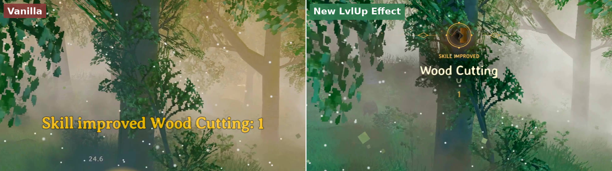

# New LvlUp Effect

**A quieter, more expressive way to celebrate your skills.**

By **Crevitka** · Version **1.2.1** · MIT License

New LvlUp Effect replaces Valheim's standard skill-increase text with a compact Nordic notification. The old level slides upwards and the new number rises into its place, followed by a small golden glow.


## Before / after



Downloads: [GitHub Releases](https://github.com/Crevitka/Valheim-New-LvlUp-Effect/releases). Russian README: [Release/README.ru.md](Release/README.ru.md).

## Features

- Animated level replacement in one position, such as **5 → 6**.
- A fine medallion, geometric ornament, soft light and a few fading embers.
- The game's own skill icons, font and localized skill names.
- Vanilla skill progression, level-up sound and world effects preserved.
- A queue for simultaneous increases; repeated pending skills are combined.
- Adjustable size, position and duration.
- Support for normal skill increases and the `raiseskill` command.
- A preview command that does not change your skills.

## Requirements

Valheim for PC and [BepInExPack Valheim](https://thunderstore.io/c/valheim/p/denikson/BepInExPack_Valheim/) (5.4.2202 or newer compatible BepInEx 5 build).

This is a **client-side** UI mod. Install it on your game client; a dedicated server does not need it. Jotunn and other UI mods are not required. Older Valheim releases, Linux and Steam Deck have not been verified.

Local build and runtime logging were checked with **Valheim 1.0.15** and **BepInExPack 5.4.2202**. This is not a guarantee of compatibility with every game version or mod combination.

## Installation

**Thunderstore / r2modman:** install through the manager and launch the modded profile.

**Manual installation:**

1. Install BepInExPack Valheim and launch the game once.
2. For the Thunderstore archive, copy `plugins/NewLvlUpEffect` into your game's `BepInEx/plugins` folder.
3. For the Nexus archive, merge the included `BepInEx` folder into the game folder containing `valheim.exe`.
4. Restart the game.

The final DLL location must be `BepInEx/plugins/NewLvlUpEffect/NewLvlUpEffect.dll`. Keep only one copy of the DLL installed.

## Preview

Add `-console` to Valheim's launch options. Enter a world, open F5, run:

```text
newlvlupeffect_preview
```

**Close F5 to start the animation.** The preview shows Running changing from 5 to 6 without modifying the character. No `devcommands` are required for this preview. The notification timer pauses while the console is open.

## Configuration

After the first launch, edit `BepInEx/config/local.valheim.newlvlupeffect.cfg`, then restart the game.

| Setting | Default | Effect |
| --- | --- | --- |
| General.Enabled | true | Enable notifications |
| General.ReplaceVanillaMessage | true | Hide vanilla skill-up HUD text, including raiseskill; keep console output |
| Appearance.Duration | 3.6 | Duration in seconds; 1.5–8 |
| Appearance.VerticalPosition | 0.77 | Height from the bottom; 0.2–0.9 |
| Appearance.Scale | 1 | Notification size; 0.6–1.5 |

## Compatibility and limitations

- This mod changes presentation, not XP, skill levels or balance.
- Other mods replacing skill notifications may produce duplicate messages. Disable their notification feature or this mod's notification feature.
- Console `raiseskill` output is preserved. A notification is queued only when the integer level actually increases.
- Large increases animate directly from the previous to the final level.
- Up to 32 notifications can wait in the queue; the oldest waiting entry is dropped if that limit is exceeded.
- Notifications are cleared when leaving the world or changing the local player.
- The ordinary gameplay path is designed for vanilla skills. Compatibility with custom skill systems has not been verified.

## Troubleshooting

If nothing appears, restart the game, close the console after the preview command and check that `Enabled = true`. Check `BepInEx/LogOutput.log` for `Loading [New LvlUp Effect 1.2.1]`, `Queued raiseskill notification` or `Showing` messages.

For a bug report, include your game version, BepInEx version, mod version, relevant log lines and a short description of how to reproduce it. Redact account names, server addresses and other personal details before sharing logs.

## Updating and removing

Close the game and replace the previous DLL. Existing configuration is retained. To uninstall, remove the mod's DLL or uninstall it through your manager. The configuration can optionally be removed too. No save migration is needed.

## Building from source

Requires Windows, a .NET SDK, Valheim and BepInExPack Valheim.

```powershell
./build-plugin.ps1 -ValheimDir 'D:\Games\Valheim'   # -> bin/Release/NewLvlUpEffect.dll
./Release/package.ps1                                 # -> Release/dist/*.zip
```

Without parameters the build uses the default Steam path. Game, Unity and BepInEx assemblies are only referenced from your installation and are not included in this repository. See [Release/SOURCE-README.md](Release/SOURCE-README.md) for implementation notes.

## Links

- **GitHub:** [github.com/Crevitka/Valheim-New-LvlUp-Effect](https://github.com/Crevitka/Valheim-New-LvlUp-Effect) — source code, issues
- **Discord:** [discord.gg/F2UehNhe96](https://discord.gg/F2UehNhe96) — support and feedback
- **Reddit:** [reddit.com/user/Crevitka](https://www.reddit.com/user/Crevitka/)
- **X:** [x.com/Crevitka](https://x.com/Crevitka)

Questions, bug reports and ideas are welcome on Discord or in GitHub issues.

## Credits and license

Created by **Crevitka**, with AI-assisted development and documentation. Distributed under the **MIT License**; see [LICENSE](LICENSE). Game icons and fonts are accessed from the installed game at runtime and are not redistributed. Valheim is developed by Iron Gate; this is an unofficial mod.
